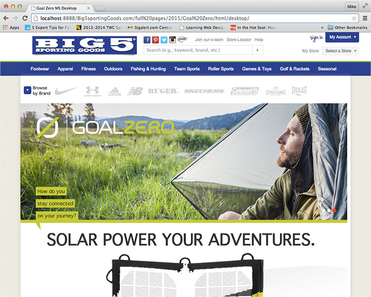
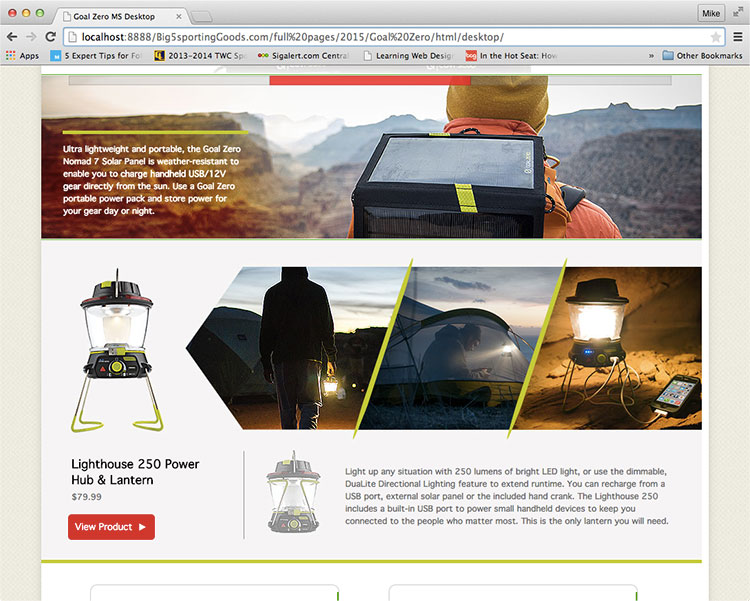
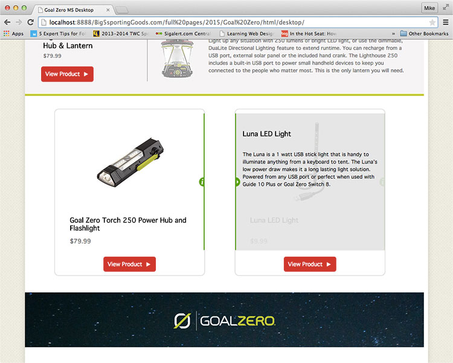
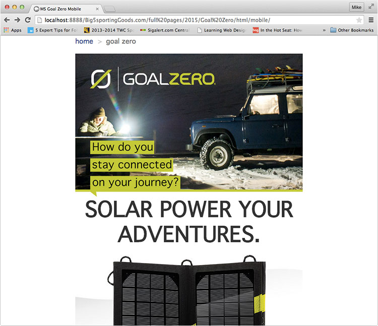
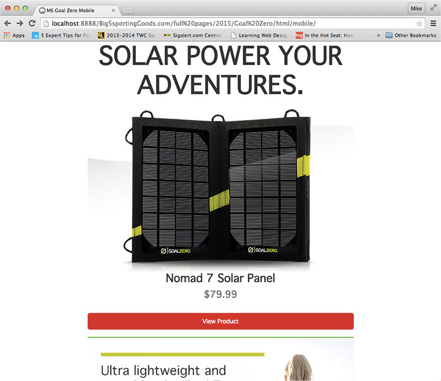
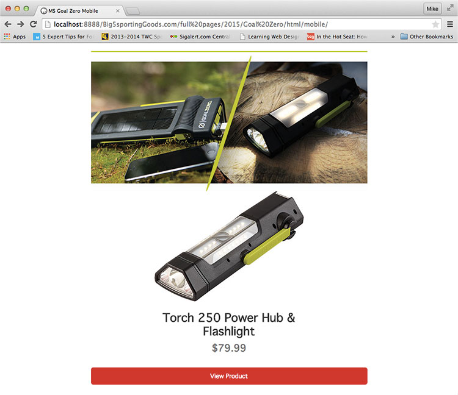

  
`big5sportinggoods.com`  

# Dates:  
2015  
# Technologies:  
HTML5, CSS3, jQuery plugin, Desktop and Mobile versions   
# Description:  
This website was meant to feature one of our vendors and show the products they have available.  

I used a jQuery plugin carousel called [Flexslider by WooThemes - http://www.woothemes.com/flexslider](http://www.woothemes.com/flexslider/) on the rotating banner up top.  I also used it in the middle section to feature one of their products and rotate to different images of it.    

**Desktop version**  
In the root folder in **index.html**,  
the CSS styles I created are between the comments  
`<!-- Michael de Leon's CSS styles.  CUT HERE. CUSTOM CSS BEGIN -->`  
and  
`<!-- Michael de Leon's CSS styles.  CUT HERE. CUSTOM CSS END -->`  

My HTML code is between the comments  
`<!-- Michael de Leon's code.  CUT HERE. CUSTOM CODE BEGIN -->`  
and  
`<!-- Michael de Leon's code.  CUT HERE. CUSTOM CODE END -->`

**Mobile version**  
In the mobile folder in **index.html**,  
the CSS styles I created are between the comments  
`<!-- Michael de Leon's CSS styles.  CUT HERE. CUSTOM CSS BEGIN -->`  
and  
`<!-- Michael de Leon's CSS styles.  CUT HERE. CUSTOM CSS END -->`  

My HTML code is between the comments  
`<!-- Michael de Leon's code.  CUT HERE. CUSTOM CODE BEGIN -->`  
and  
`<!-- Michael de Leon's code.  CUT HERE. CUSTOM CODE END -->`  
# Screenshots:
  

  

  

  

  

  
